# Lab 01: MapReduce and Document Oriented Model

## Environment preparation

### 1. Download Debian 11 image to VirtualBox, import and run

You'll need to create a VM without ISO file, configure hardware (memory and processor), and use virtual hard disk downloaded from [link](https://www.osboxes.org/debian/). 

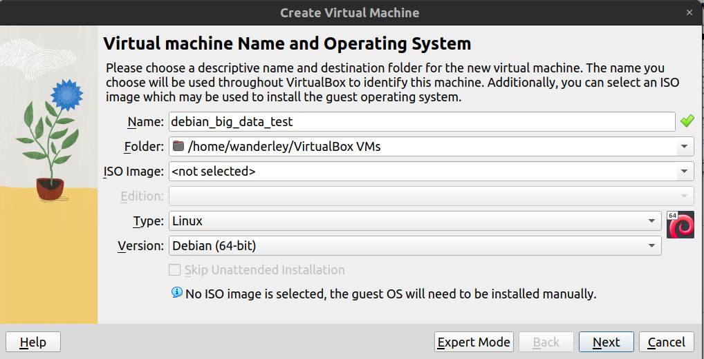

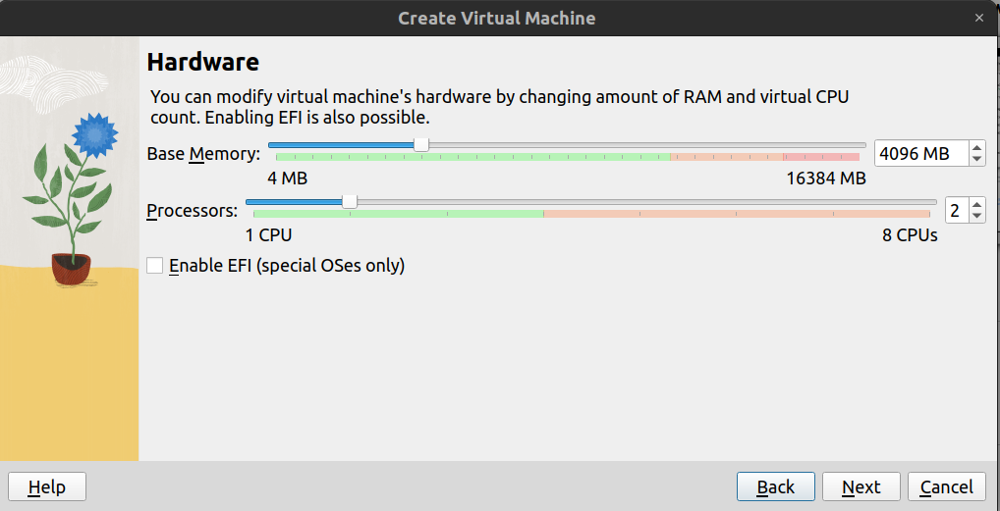

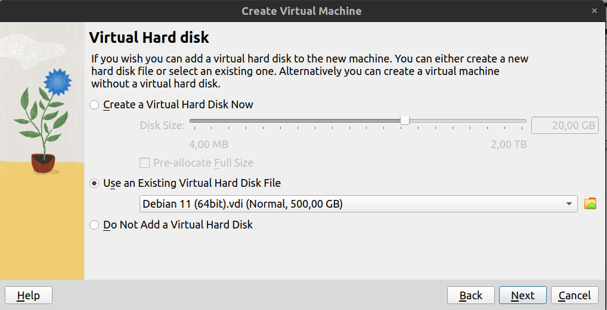

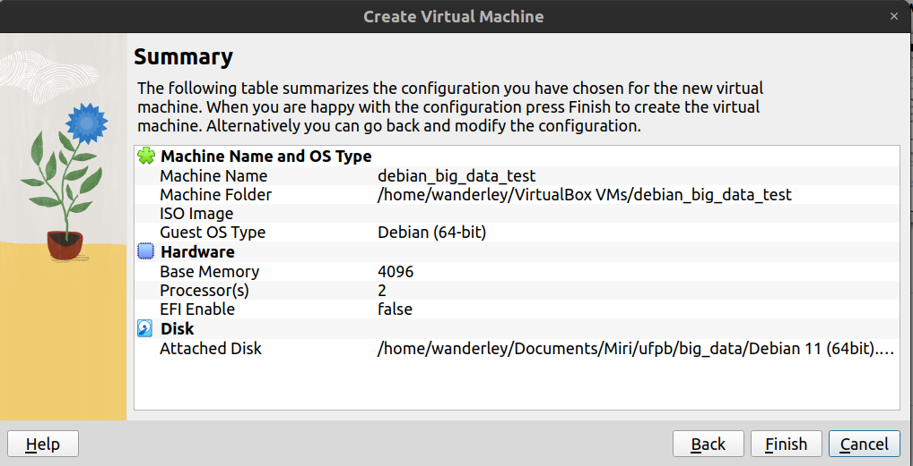


This assure that your VM will be prepared correctly.

> Hint: Default password is `osboxes.org`

### 2. Create MongoAtlas cluster and make connection using mongo shell or compass

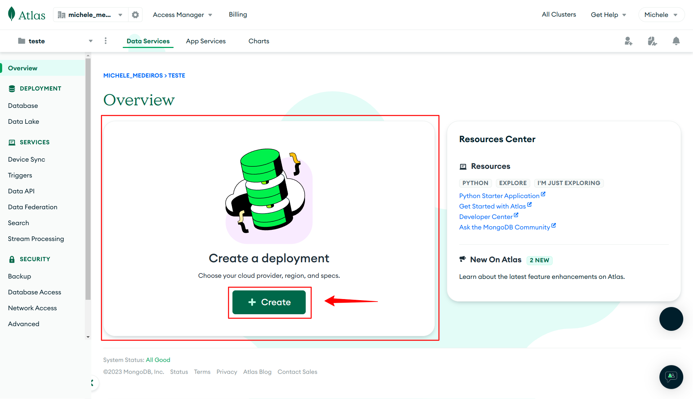

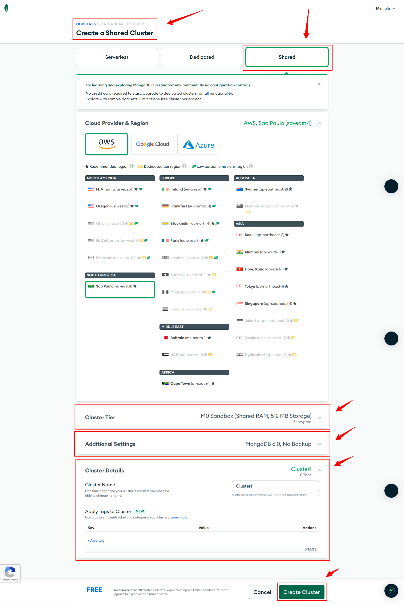

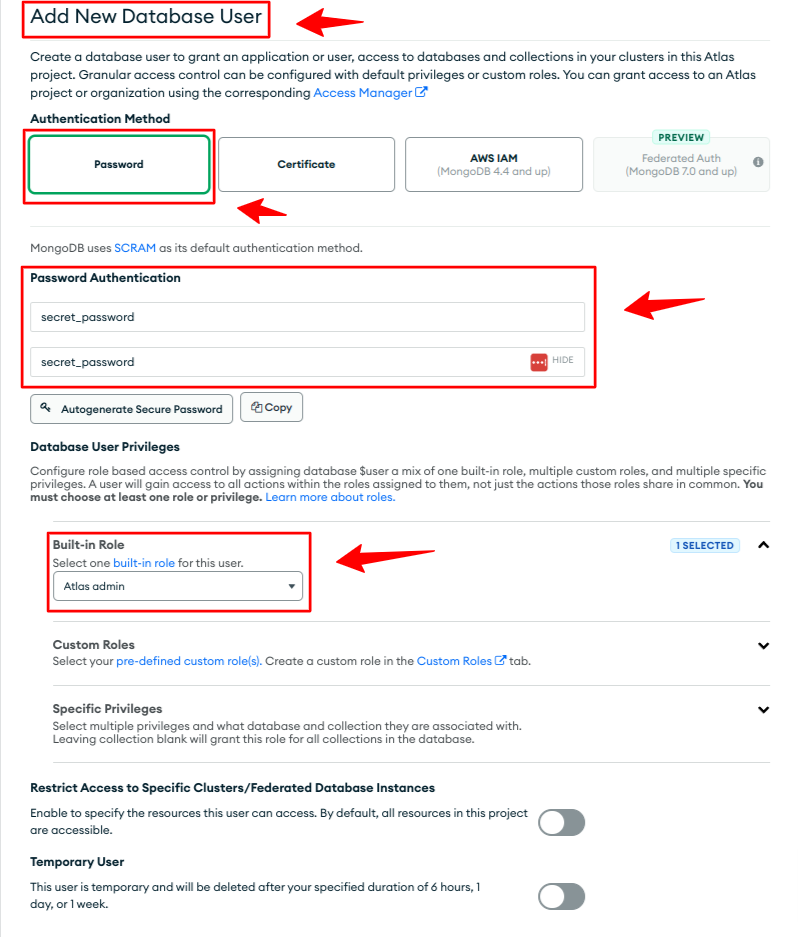

TODO: Add connection config. But basically was to add access of machine IP that will connect to mongoDB Atlas cluster. 

If any problem happen. Try to free access to internet. Could be something related to machine IP configuration. 

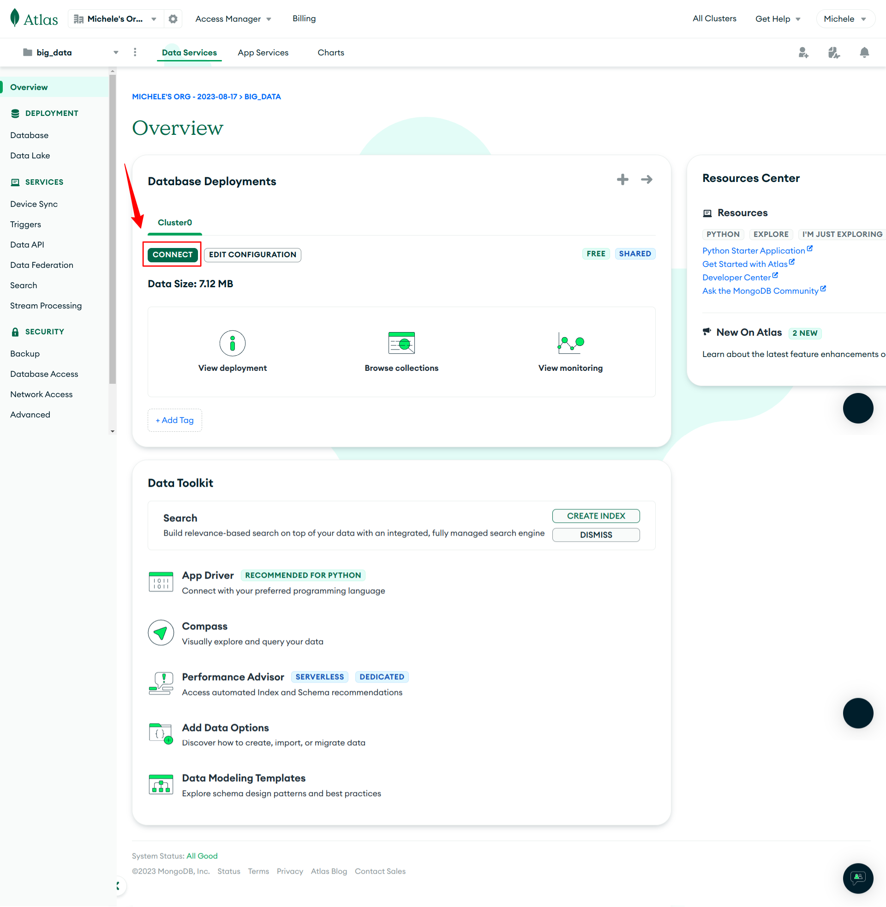

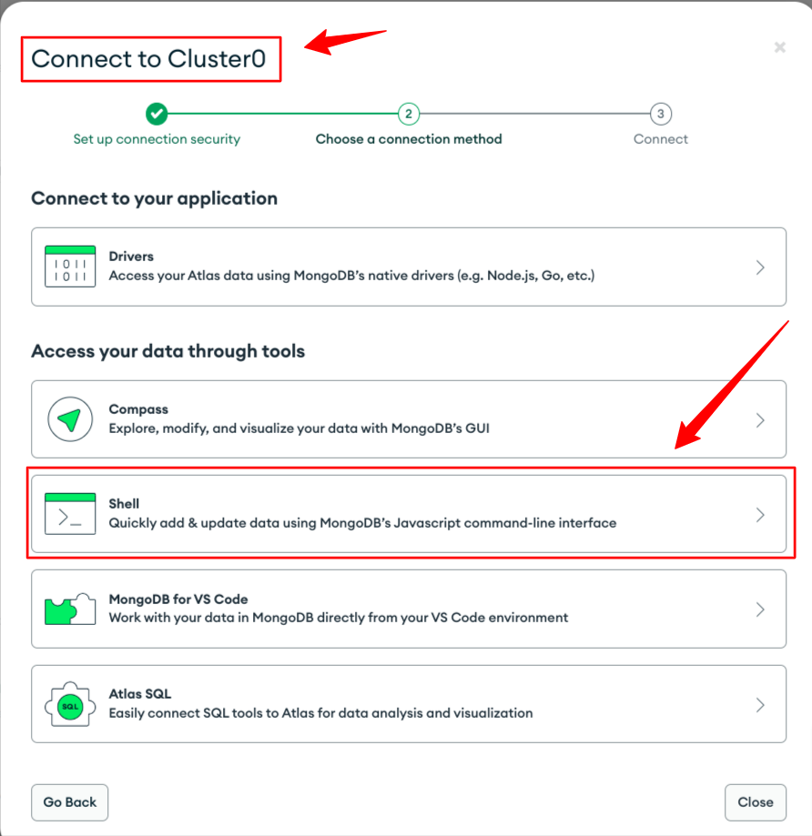

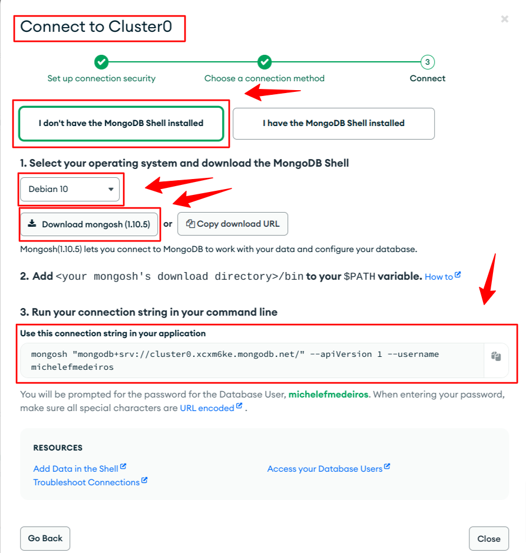

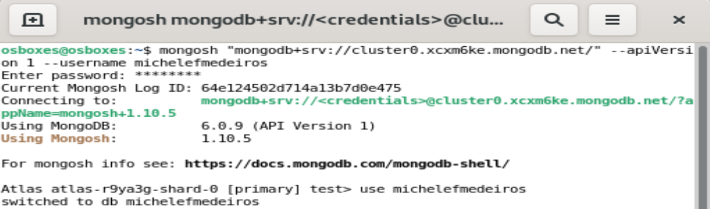

### 3. Download and import data samples from [link](https://github.com/ozlerhakan/mongodb-json-files)

You'll need to use mongoimport and mongorestore commands. If don't have, install MongoDB Command Line Database Tools from [here](https://www.mongodb.com/try/download/database-tools).

Then, use commands to import 2 datasets:

#### 1. countries-big (json)

Example of code:
```
mongoimport --uri mongodb+srv://michelefmedeiros:<PASSWORD>@cluster0.xcxm6ke.mongodb.net/<DATABASE> --collection <COLLECTION> --type <FILETYPE> --file <FILENAME>
```
#### 2. tweets (bson)

Example of code:
```
mongorestore --uri mongodb+srv://michelefmedeiros:<PASSWORD>@cluster0.xcxm6ke.mongodb.net 
```

### 4. Read tutorials from mongoDB about MapReduce and Sharding

#### [MapReduce](https://www.mongodb.com/docs/manual/core/map-reduce/)

#### [MapReduce Examples](https://www.mongodb.com/docs/manual/tutorial/map-reduce-examples/)

#### [MapReduce to Aggregation](https://www.mongodb.com/docs/manual/reference/map-reduce-to-aggregation-pipeline/)

#### [Sharding](https://www.mongodb.com/docs/manual/sharding/)

## Exercices

###  MapReduce with mongoDB 1
Load countries-big database. Find 10 mainly languages used on reddit documents.

#### 1. MapReduce Implementation

[Mapreduce is not allowed in mongoDB Atlas free tier cluster at this moment](https://stackoverflow.com/questions/45663890/unhandled-rejection-mongoerror-cmd-not-allowed-mapreduce) -> [Docs](https://www.mongodb.com/docs/atlas/unsupported-commands/)

#### 1.1 Aggregation Implementation

``` bash
db.countries.aggregate([ 
    {
        $group: {
            _id: "$Language", 
            total: {$sum: 1} 
        }
    }, 
    {
        $sort: {total: -1}
    }, 
    {
        $limit: 20
    } 
])
```

#### 2. MapReduce Result

[Mapreduce is not allowed in mongoDB Atlas free tier cluster at this moment](https://stackoverflow.com/questions/45663890/unhandled-rejection-mongoerror-cmd-not-allowed-mapreduce) -> [Docs](https://www.mongodb.com/docs/atlas/unsupported-commands/)


#### 2.1 Aggregation Result
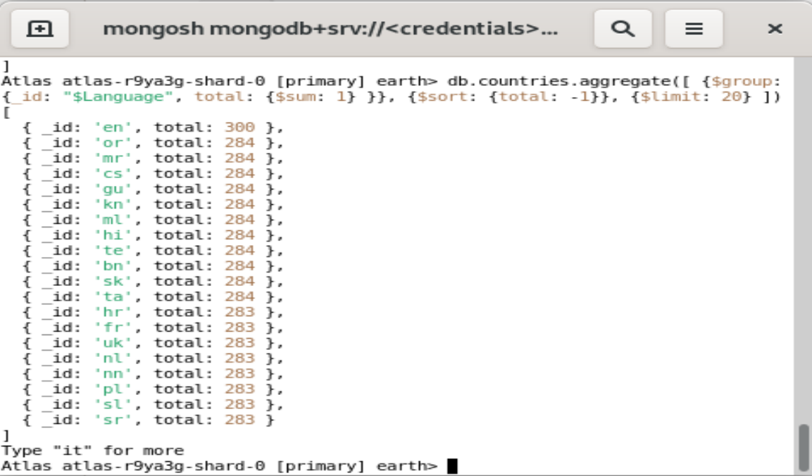

#### 3. 10 first results

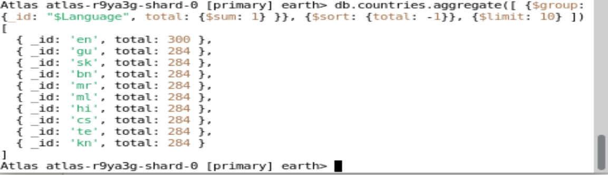

### MapReduce with mongoDB 2
Load twitter database. What are the 10 main hashtags used on tweets delivered.


#### 4. findOne() and hasOwnProperty() results

##### 4.1 findOne()

``` bash
{
  _id: ObjectId("553be107e8f1e57878b72b32"),
  created_at: 'Sat Apr 25 18:05:57 +0000 2015',
  id: 592026777087803400,
  id_str: '592026777087803392',
  text: 'RT @BaronNashorTR: #IWCI @RiotRegarnur @TRScarlet @kaankural @LoLTrOfficial @LoLeSpor Durum 2-1 http://t.co/Z67anvRXKo',
  source: '<a href="http://twitter.com" rel="nofollow">Twitter Web Client</a>',
  truncated: false,
  in_reply_to_status_id: null,
  in_reply_to_status_id_str: null,
  in_reply_to_user_id: null,
  in_reply_to_user_id_str: null,
  in_reply_to_screen_name: null,
  user: {
    profile_background_tile: false,
    profile_image_url_https: 'https://pbs.twimg.com/profile_images/576254436936298498/iMn5gYKc_normal.png',
    id_str: '607921391',
    profile_location: null,
    is_translator: false,
    profile_background_image_url_https: 'https://pbs.twimg.com/profile_background_images/378800000099574815/925c84bfcac64953ecaf6b1df674dc09.png',
    profile_use_background_image: true,
    description: 'League of Legends Türkiye Resmi Twitter Hesabı. Garen ve kostümü için: http://t.co/8DjgIdmSLV',
    created_at: 'Thu Jun 14 07:38:19 +0000 2012',
    lang: 'tr',
    profile_image_url: 'http://pbs.twimg.com/profile_images/576254436936298498/iMn5gYKc_normal.png',
    default_profile_image: false,
    name: 'League of Legends',
    url: 'http://t.co/U7nwnR9FLT',
    entities: {
      url: {
        urls: [
          {
            expanded_url: 'http://tr.leagueoflegends.com',
            display_url: 'tr.leagueoflegends.com',
            indices: [ 0, 22 ],
            url: 'http://t.co/U7nwnR9FLT'
          }
        ]
      },
      description: {
        urls: [
          {
            display_url: 'bitly.com/GarenKazan',
            indices: [ 71, 93 ],
            url: 'http://t.co/8DjgIdmSLV',
            expanded_url: 'http://www.bitly.com/GarenKazan'
          }
        ]
      }
    },
    profile_link_color: '0084B4',
    profile_sidebar_fill_color: 'DDEEF6',
    notifications: false,
    time_zone: 'Istanbul',
    statuses_count: 6546,
    profile_background_image_url: 'http://pbs.twimg.com/profile_background_images/378800000099574815/925c84bfcac64953ecaf6b1df674dc09.png',
    geo_enabled: false,
    profile_sidebar_border_color: 'FFFFFF',
    profile_text_color: '333333',
    default_profile: false,
    following: true,
    id: 607921391,
    followers_count: 439224,
    listed_count: 83,
    utc_offset: 10800,
    verified: false,
    contributors_enabled: false,
    follow_request_sent: false,
    screen_name: 'LoLTrOfficial',
    protected: false,
    favourites_count: 82,
    location: 'Turkey',
    friends_count: 48,
    is_translation_enabled: false,
    profile_background_color: '000000',
    profile_banner_url: 'https://pbs.twimg.com/profile_banners/607921391/1404129910'
  },
  geo: null,
  coordinates: null,
  place: null,
  contributors: null,
  retweeted_status: {
    contributors: null,
    retweet_count: 24,
    possibly_sensitive_appealable: false,
    truncated: false,
    in_reply_to_user_id: null,
    in_reply_to_user_id_str: null,
    place: null,
    entities: {
      symbols: [],
      user_mentions: [
        {
          screen_name: 'RiotRegarnur',
          name: 'Riot Regarnur',
          id: 2274644820,
          id_str: '2274644820',
          indices: [ 6, 19 ]
        },
        {
          id: 2942295671,
          id_str: '2942295671',
          indices: [ 20, 30 ],
          screen_name: 'TRScarlet',
          name: 'Can Çaldıran'
        },
        {
          indices: [ 31, 41 ],
          screen_name: 'kaankural',
          name: 'Kaan Kural',
          id: 39688781,
          id_str: '39688781'
        },
        {
          screen_name: 'LoLTrOfficial',
          name: 'League of Legends',
          id: 607921391,
          id_str: '607921391',
          indices: [ 42, 56 ]
        },
        {
          screen_name: 'LoLeSpor',
          name: 'LoL eSpor',
          id: 2797847637,
          id_str: '2797847637',
          indices: [ 57, 66 ]
        }
      ],
      urls: [],
      media: [
        {
          media_url: 'http://pbs.twimg.com/media/CDdLeUcWYAEL-Nr.jpg',
          media_url_https: 'https://pbs.twimg.com/media/CDdLeUcWYAEL-Nr.jpg',
          display_url: 'pic.twitter.com/Z67anvRXKo',
          type: 'photo',
          sizes: {
            medium: { w: 600, h: 314, resize: 'fit' },
            large: { w: 1024, h: 537, resize: 'fit' },
            thumb: { h: 150, resize: 'crop', w: 150 },
            small: { resize: 'fit', w: 340, h: 178 }
          },
          id: 592024860278284300,
          id_str: '592024860278284289',
          indices: [ 77, 99 ],
          url: 'http://t.co/Z67anvRXKo',
          expanded_url: 'http://twitter.com/BaronNashorTR/status/592024862266433536/photo/1'
        }
      ],
      hashtags: [ { text: 'IWCI', indices: [ 0, 5 ] } ]
    },
    retweeted: false,
    text: '#IWCI @RiotRegarnur @TRScarlet @kaankural @LoLTrOfficial @LoLeSpor Durum 2-1 http://t.co/Z67anvRXKo',
    user: {
      utc_offset: 10800,
      verified: false,
      profile_use_background_image: true,
      notifications: false,
      favourites_count: 3231,
      profile_image_url: 'http://pbs.twimg.com/profile_images/434643192516866048/LCf2SI6B_normal.jpeg',
      profile_sidebar_border_color: 'FFFFFF',
      friends_count: 534,
      profile_link_color: '0084B4',
      description: "Oyun çevirten, Buff veren, Totem seven, 20. dakikada hortlayan, LOL'ün en kudretli yaratığı. \n" +
        'Baron sizi kutsasın.',
      location: 'Sihirdar Vadisi',
      followers_count: 3063,
      geo_enabled: false,
      profile_background_tile: true,
      default_profile: false,
      name: 'Baron Nashor',
      time_zone: 'Kyiv',
      lang: 'tr',
      contributors_enabled: false,
      profile_background_image_url_https: 'https://pbs.twimg.com/profile_background_images/378800000145616164/nDpGlqy9.jpeg',
      created_at: 'Tue Feb 26 21:58:43 +0000 2013',
      id_str: '1223034078',
      profile_location: null,
      url: 'http://t.co/umUfXjffkI',
      listed_count: 7,
      profile_text_color: '333333',
      default_profile_image: false,
      id: 1223034078,
      protected: false,
      statuses_count: 1794,
      is_translation_enabled: false,
      profile_background_color: '00070A',
      profile_background_image_url: 'http://pbs.twimg.com/profile_background_images/378800000145616164/nDpGlqy9.jpeg',
      profile_banner_url: 'https://pbs.twimg.com/profile_banners/1223034078/1425724317',
      profile_sidebar_fill_color: 'DDEEF6',
      screen_name: 'BaronNashorTR',
      follow_request_sent: false,
      is_translator: false,
      profile_image_url_https: 'https://pbs.twimg.com/profile_images/434643192516866048/LCf2SI6B_normal.jpeg',
      following: false,
      entities: {
        url: {
          urls: [
            {
              url: 'http://t.co/umUfXjffkI',
              expanded_url: 'http://lolespor.com/',
              display_url: 'lolespor.com',
              indices: [Array]
            }
          ]
        },
        description: { urls: [] }
      }
    },
    coordinates: null,
    possibly_sensitive: false,
    lang: 'tr',
    created_at: 'Sat Apr 25 17:58:21 +0000 2015',
    favorite_count: 95,
    favorited: false,
    in_reply_to_status_id: null,
    in_reply_to_status_id_str: null,
    in_reply_to_screen_name: null,
    geo: null,
    extended_entities: {
      media: [
        {
          indices: [ 77, 99 ],
          url: 'http://t.co/Z67anvRXKo',
          expanded_url: 'http://twitter.com/BaronNashorTR/status/592024862266433536/photo/1',
          id: 592024860278284300,
          id_str: '592024860278284289',
          display_url: 'pic.twitter.com/Z67anvRXKo',
          type: 'photo',
          sizes: {
            medium: { w: 600, h: 314, resize: 'fit' },
            large: { w: 1024, h: 537, resize: 'fit' },
            thumb: { h: 150, resize: 'crop', w: 150 },
            small: { w: 340, h: 178, resize: 'fit' }
          },
          media_url: 'http://pbs.twimg.com/media/CDdLeUcWYAEL-Nr.jpg',
          media_url_https: 'https://pbs.twimg.com/media/CDdLeUcWYAEL-Nr.jpg'
        }
      ]
    },
    id: 592024862266433500,
    id_str: '592024862266433536',
    source: '<a href="http://twitter.com" rel="nofollow">Twitter Web Client</a>'
  },
  retweet_count: 24,
  favorite_count: 0,
  entities: {
    hashtags: [ { text: 'IWCI', indices: [ 19, 24 ] } ],
    symbols: [],
    user_mentions: [
      {
        id: 1223034078,
        id_str: '1223034078',
        indices: [ 3, 17 ],
        screen_name: 'BaronNashorTR',
        name: 'Baron Nashor'
      },
      {
        id_str: '2274644820',
        indices: [ 25, 38 ],
        screen_name: 'RiotRegarnur',
        name: 'Riot Regarnur',
        id: 2274644820
      },
      {
        name: 'Can Çaldıran',
        id: 2942295671,
        id_str: '2942295671',
        indices: [ 39, 49 ],
        screen_name: 'TRScarlet'
      },
      {
        screen_name: 'kaankural',
        name: 'Kaan Kural',
        id: 39688781,
        id_str: '39688781',
        indices: [ 50, 60 ]
      },
      {
        id: 607921391,
        id_str: '607921391',
        indices: [ 61, 75 ],
        screen_name: 'LoLTrOfficial',
        name: 'League of Legends'
      },
      {
        id_str: '2797847637',
        indices: [ 76, 85 ],
        screen_name: 'LoLeSpor',
        name: 'LoL eSpor',
        id: 2797847637
      }
    ],
    urls: [],
    media: [
      {
        indices: [ 96, 118 ],
        url: 'http://t.co/Z67anvRXKo',
        expanded_url: 'http://twitter.com/BaronNashorTR/status/592024862266433536/photo/1',
        source_user_id: 1223034078,
        source_user_id_str: '1223034078',
        media_url_https: 'https://pbs.twimg.com/media/CDdLeUcWYAEL-Nr.jpg',
        display_url: 'pic.twitter.com/Z67anvRXKo',
        id: 592024860278284300,
        id_str: '592024860278284289',
        media_url: 'http://pbs.twimg.com/media/CDdLeUcWYAEL-Nr.jpg',
        type: 'photo',
        sizes: {
          small: { h: 178, resize: 'fit', w: 340 },
          medium: { w: 600, h: 314, resize: 'fit' },
          large: { resize: 'fit', w: 1024, h: 537 },
          thumb: { w: 150, h: 150, resize: 'crop' }
        },
        source_status_id: 592024862266433500,
        source_status_id_str: '592024862266433536'
      }
    ]
  },
  extended_entities: {
    media: [
      {
        media_url: 'http://pbs.twimg.com/media/CDdLeUcWYAEL-Nr.jpg',
        sizes: {
          medium: { resize: 'fit', w: 600, h: 314 },
          large: { w: 1024, h: 537, resize: 'fit' },
          thumb: { w: 150, h: 150, resize: 'crop' },
          small: { w: 340, h: 178, resize: 'fit' }
        },
        expanded_url: 'http://twitter.com/BaronNashorTR/status/592024862266433536/photo/1',
        source_user_id: 1223034078,
        source_user_id_str: '1223034078',
        media_url_https: 'https://pbs.twimg.com/media/CDdLeUcWYAEL-Nr.jpg',
        display_url: 'pic.twitter.com/Z67anvRXKo',
        type: 'photo',
        source_status_id: 592024862266433500,
        source_status_id_str: '592024862266433536',
        id: 592024860278284300,
        id_str: '592024860278284289',
        indices: [ 96, 118 ],
        url: 'http://t.co/Z67anvRXKo'
      }
    ]
  },
  favorited: false,
  retweeted: false,
  possibly_sensitive: false,
  possibly_sensitive_appealable: false,
  lang: 'tr'
}
```

##### 4.2 hasOwnProperty()


#### 5. MapReduce Implementation

[Mapreduce is not allowed in mongoDB Atlas free tier cluster at this moment](https://stackoverflow.com/questions/45663890/unhandled-rejection-mongoerror-cmd-not-allowed-mapreduce) -> [Docs](https://www.mongodb.com/docs/atlas/unsupported-commands/)


#### 5.1 Aggregation Implementation

``` bash
db.tweet.aggregate([
    {$unwind: '$entities.hashtags'},
    {$group: {
        _id: '$entities.hashtags.text', 
        hashtag_count: {$sum: 1}
    }},
    {$sort: {hashtag_count: -1}},
    {$limit: 20}
])
 ```

#### 6. MapReduce Result

[Mapreduce is not allowed in mongoDB Atlas free tier cluster at this moment](https://stackoverflow.com/questions/45663890/unhandled-rejection-mongoerror-cmd-not-allowed-mapreduce) -> [Docs](https://www.mongodb.com/docs/atlas/unsupported-commands/)


#### 6.1 Aggregation Result

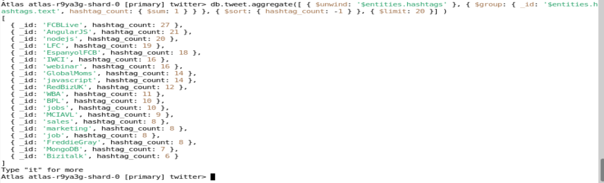

#### 7. 10 first results

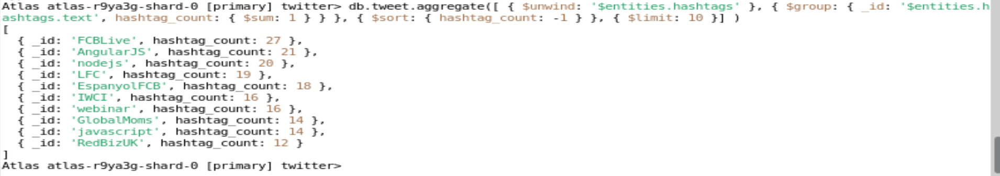


###  Sharding

#### 8. What is Sharding on mongoDB?

Sharding in MongoDB is a data distribution and partitioning technique used to horizontally scale a database system across multiple servers or nodes. It is designed to handle large volumes of data and high levels of traffic by distributing the data across multiple machines, thereby improving performance, increasing capacity, and providing better fault tolerance.

In a sharded MongoDB cluster, data is divided into smaller subsets called "shards," and each shard is hosted on a separate server or replica set. This allows for distributing the data and the read/write workload across multiple machines, which can collectively handle more data and queries than a single server could.

#### 9. What are the diferent components necessary to implement sharding? 

A MongoDB sharded cluster consists of the following components:

- shard: Each shard contains a subset of the sharded data. Each shard can be deployed as a replica set.

- mongos: The mongos acts as a query router, providing an interface between client applications and the sharded cluster. Starting in MongoDB 4.4, mongos can support hedged reads to minimize latencies.

- config servers: Config servers store metadata and configuration settings for the cluster.

The following graphic describes the interaction of components within a sharded cluster:

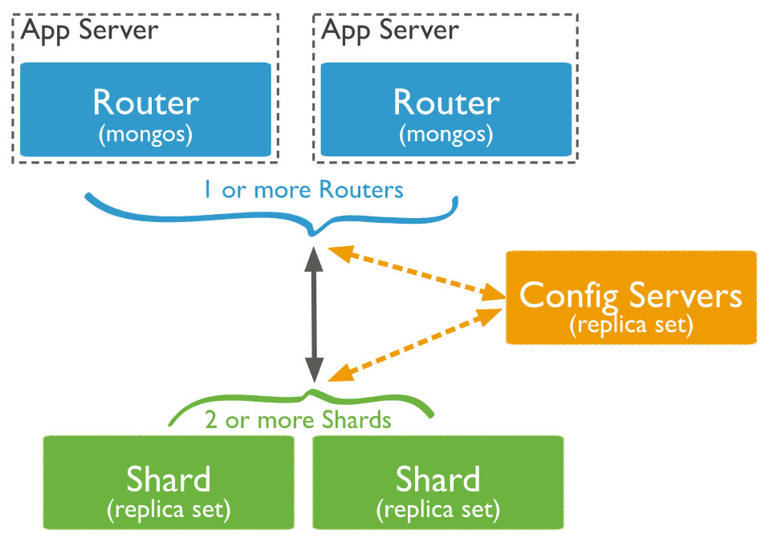

#### 10. Explain the sharding architecture on mongoDB

The sharding architecture in MongoDB involves the distribution of data across multiple servers or nodes to create a sharded cluster. This architecture is designed to support large-scale data storage and high query loads by dividing the data into smaller subsets called shards. Each shard is hosted on a separate server or replica set. Here's a more detailed explanation of the sharding architecture in MongoDB:

1. Shard Servers:
These are individual MongoDB instances responsible for storing a portion of the sharded data. Each shard server can be a standalone MongoDB instance or a replica set (a group of MongoDB servers that maintain the same data). The data within a shard is distributed based on the shard key.

2. Config Servers:
Config servers store metadata about the sharded cluster, including information about which chunks of data are on which shards. This metadata is crucial for the sharding system to route queries to the correct shards. A config server cluster typically consists of three servers for redundancy.

3. Query Routers (mongos):
Query routers are proxy servers that act as an interface between the client applications and the sharded cluster. Clients send their queries to the query routers, which analyze the queries and route them to the appropriate shards. Query routers also handle the aggregation of results from multiple shards, making it appear as if the entire cluster is a single database. Multiple query routers can be deployed for high availability.

4. Shard Key:
The shard key is a field or set of fields chosen to determine how data is distributed across the shards. It's essential to choose a shard key that evenly distributes data and evenly distributes query load. Poorly chosen shard keys can lead to data imbalances and performance issues.

5. Balancer:
The balancer is a component responsible for moving chunks of data between shards to maintain an even distribution of data across the cluster. MongoDB's balancer runs automatically in the background, ensuring that data is balanced and evenly distributed.

6. Chunks:
Data in a sharded collection is divided into chunks, each containing a range of shard key values. These chunks are distributed across the shards. The balancer is responsible for moving chunks between shards to maintain a balanced distribution.

7. Metadata Database (config database):
The config database stores metadata about the sharded cluster configuration, including information about shards, chunks, and the shard key. It is managed by the config servers and is essential for the cluster's proper functioning.

8. Router Configuration:
Each query router (mongos) needs to be configured with the addresses of the config servers and shard servers. This configuration allows the query router to route queries and manage the distribution of data.

9. Connection String:
Applications need a connection string that includes the addresses of the query routers. This connection string allows applications to connect to the sharded cluster and send queries to the appropriate shards.
