# Lab 02: Key-value Data Model

## Environment preparation

### 1. Install Redis to get redis-cli

You'll need to install Redis at your debian VM machine. Follow those steps from [Redis docs](https://redis.io/docs/getting-started/installation/install-redis-on-linux/).

```bash
$ sudo apt install lsb-release curl gpg

$ curl -fsSL https://packages.redis.io/gpg | sudo gpg --dearmor -o /usr/share/keyrings/redis-archive-keyring.gpg

$ sudo apt-get update

$ sudo apt-get install redis
```

This assure that your VM will be with Redis.

### 2. Create Redis cluster, database and make connection using redis-cli

We'll follow [redis quickstart documentation](https://docs.redis.com/latest/rc/rc-quickstart/). 

Create account or sign in at [link](https://app.redislabs.com/).


Create a subscription

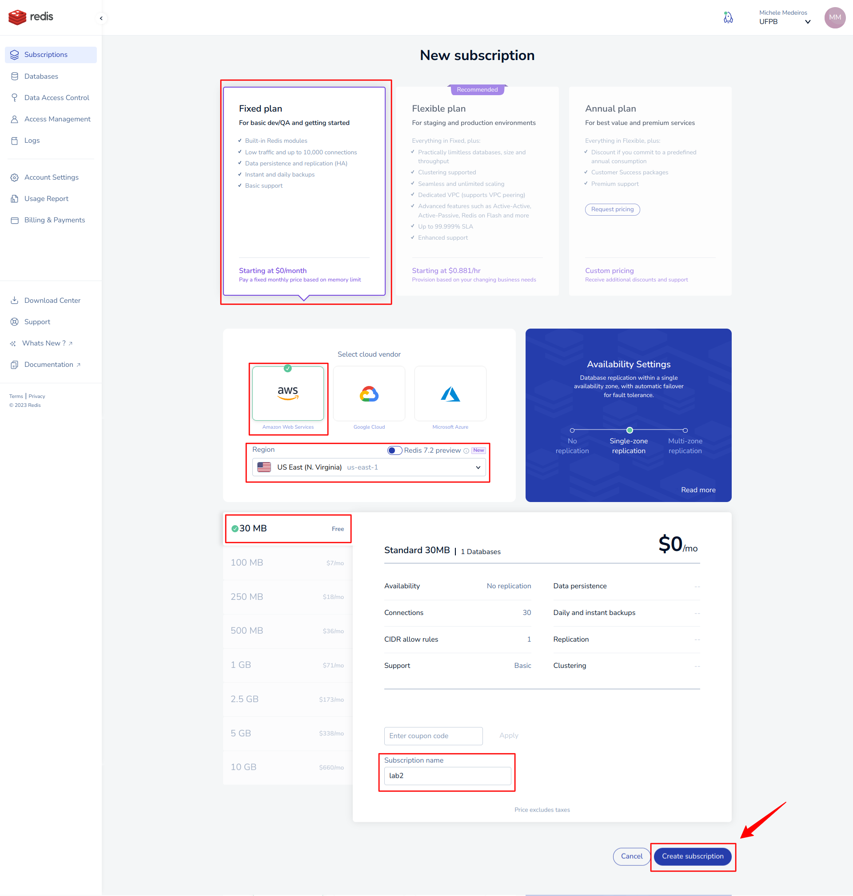

Create a database

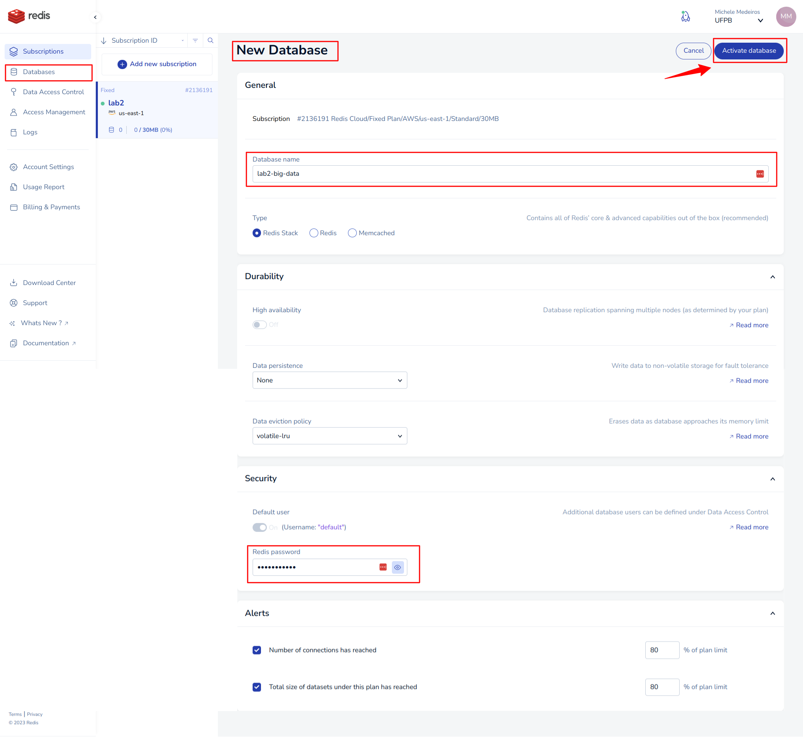

After activation, let's connect 


Copy generated code into your VM terminal

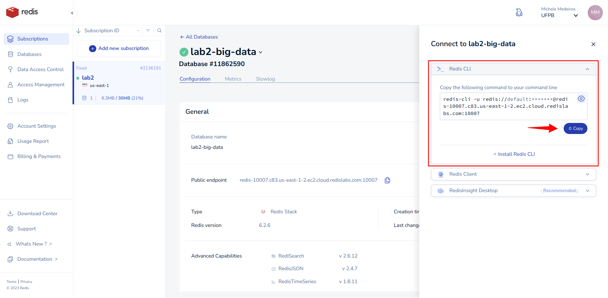


## Exercices

###  1. Create a data model at Redis that create relationship between article and tags

- Each article have name, description, filename and posting_date
- Each article could have zero, one or more tag
- Each tag could have zero, one or more article

Data model should be similar to SQL model:

```
CREATE TABLE articles(
    id            int not null primary key,
    name          varchar(100),
    description   varchar(100),
    filename      varchar(30),
    posting_date  date
);

CREATE TABLE articles_tags(
    id            int not null,
    tag           varchar(100) not null,
    primary key (
        id,
        tag
    )   
);

CREATE INDEX tag on articles_tags(tag);
```

So, let's do it


###  2. Add data to model


```
hset article:1 name "article_1_name" description "article_1_description" filename "article_1_filename.pdf" posting_date "2023-08-30"

hset article:2 name "article_2_name" description "article_2_description" filename "article_2_filename.pdf" posting_date "2023-08-30"

hset article:3 name "article_3_name" description "article_3_description" filename "article_3_filename.pdf" posting_date "2023-08-30"

hset article:4 name "article_4_name" description "article_4_description" filename "article_4_filename.pdf" posting_date "2023-08-30"

hset article:5 name "article_5_name" description "article_5_description" filename "article_5_filename.pdf" posting_date "2023-08-30"
```

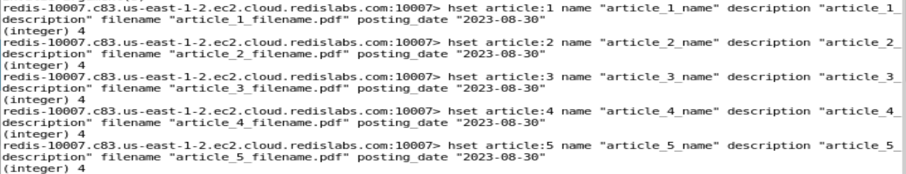

```
sadd tag:1 article:1
sadd tag:2 article:2 article:3
sadd tag:3 article:4
```

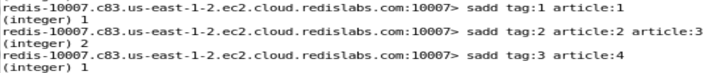

```
hset article_tags:1 tag:1 1
hset article_tags:2 tag:2 1
hset article_tags:3 tag:2 1
hset article_tags:4 tag:3 1
```

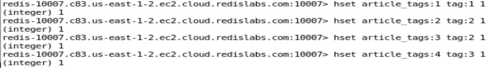

```
hset article_tags:article:1 tag:1 1
hset article_tags:article:2 tag:2 1
hset article_tags:article:3 tag:2 1
hset article_tags:article:4 tag:3 1
```

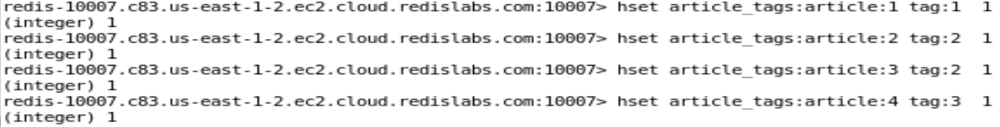

###  3. Query all articles

```
scan 0 match article:* count 10
```

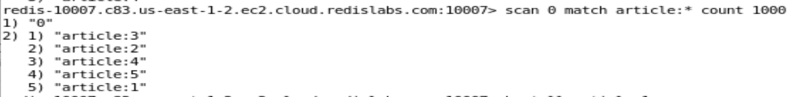

###  4. Query a single article, and their tags

```
hgetall article:1
```
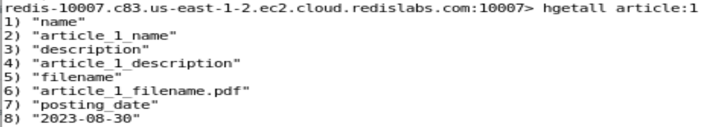

```
hgetall article_tags:article:1
```
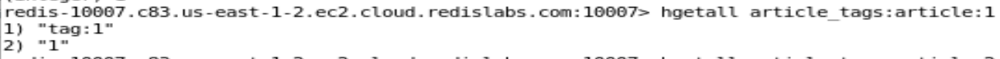

###  5. To one tag, query all articles related

```
smembers tag:2
```
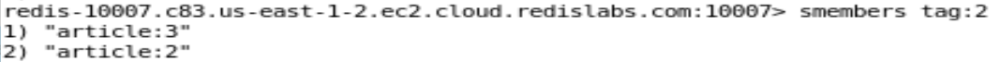
