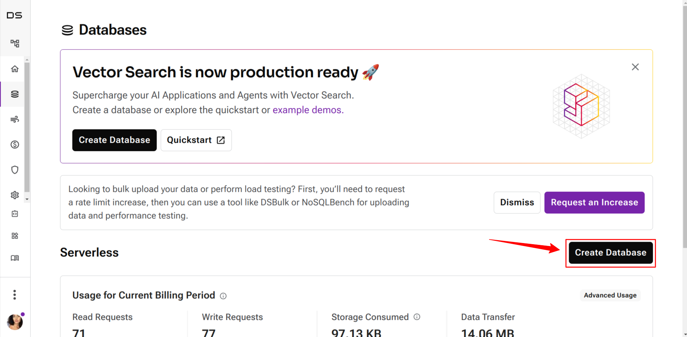
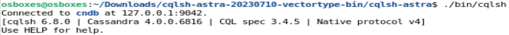
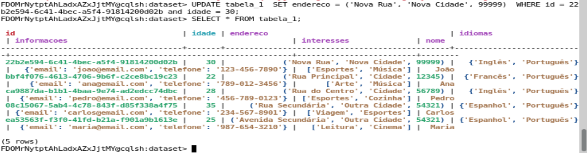

# Lab 03: Column Data Model

## Environment preparation

### 1. Create account and database on DataStax / AstraDB

#### 1.1 Create account on [DataStax](https://astra.datastax.com/)

#### 1.2. Create [Database](https://docs.datastax.com/en/astra-serverless/docs/manage/db/managing-db.html#_create_your_database)




### 2. Install [CQL shell](https://docs.datastax.com/en/astra-serverless/docs/connect/cql/connect-cqlsh.html#_standalone_cql_shell) and config to connect to database previous created 


#### 2.1 Download CQL shell from [link](https://downloads.datastax.com/#cqlsh).


1. Change to the directory where you downloaded the CQLSH tarball and then extract it: 

```
$ cd /<download_directory>
$ tar -xvf cqlsh-astra-<date>-bin.tar.gz
```

- **date** - The date that the tarball was released, such as 20230710.

2. Configure the cqlshrc file If you do not want to pass the secure connect bundle on the command line every time, set up the location in your cqlshrc file.

- In the [authentication] section of the cqlshrc file in ~/.cassandra, include the Client ID and Client Secret from your application token. Configure the [connection] section of the cqlshrc file in ~/.cassandra to include the path to your secure connect bundle.

```
[authentication]
username = clientID
password = clientSecret

[connection]
secure_connect_bundle = **/path/to/**secure-connect-**database_name**.zip
```

Example:

```
[authentication]
username = cmdbdbmhvfOrCDsifYweWode
password = R6avDLD_CLdTtUMOAPIG+mlmwRqYa9ZyqZZIwSeR0.W5_.Hvk2SDUtrZC.yvFEXouR1RTUJuv3lcdN3LgPEK9YEgFk._RRCnn88dJ2ipkJ9EpXD2BzSnsIAqkg.JM3O8

[connection]
secure_connect_bundle = /home/osboxes/Downloads/secure-connect-big-data.zip 
```

3. From the directory where you extracted the CQLSH tarball, run the cqlsh script from the command line:

```bash
$ cd /cqlsh-astra
$ ./bin/cqlsh
```



#### 2.2 (if necessary) Install python > 2.7.12 version

- Python version with TLS Support. A minimum of 2.7.12

```bash
$ sudo apt-get install python3.10
```

## Exercices

### 1. Create script with CQL instructions

### 2. Define scheme for 2 different tables with different types

#### 2.1 Define at least one column for each one of following types: tuple, list, set and map

```
-- Cria a primeira tabela para entidades de tipo diferente
CREATE TABLE IF NOT EXISTS tabela_1 (
    id UUID,
    nome TEXT,
    idade INT,
    endereco TUPLE<TEXT, TEXT, INT>,
    interesses LIST<TEXT>,
    idiomas SET<TEXT>,
    informacoes MAP<TEXT, TEXT>,
    PRIMARY KEY ((id), idade))
WITH CLUSTERING ORDER BY (idade ASC);

-- Cria a segunda tabela para entidades de tipo diferente
CREATE TABLE IF NOT EXISTS tabela_2 (
    id UUID PRIMARY KEY,
    titulo TEXT,
    autores LIST<TEXT>,
    publicacao MAP<TEXT, INT>
);
```


#### 2.2. Insert around 5 lines for each table


```
-- Insere dados na primeira tabela
INSERT INTO tabela_1 (id, nome, idade, endereco, interesses, idiomas, informacoes)
VALUES (uuid(), 'João', 30, ('Rua Principal', 'Cidade', 12345), ['Esportes', 'Música'], {'Português', 'Inglês'}, {'email' : 'joao@email.com', 'telefone' : '123-456-7890'});
   
INSERT INTO tabela_1 (id, nome, idade, endereco, interesses, idiomas, informacoes)
VALUES (uuid(), 'Maria', 25, ('Avenida Secundária', 'Outra Cidade', 54321), ['Leitura', 'Cinema'], {'Português', 'Espanhol'}, {'email' : 'maria@email.com', 'telefone' : '987-654-3210'});

INSERT INTO tabela_1 (id, nome, idade, endereco, interesses, idiomas, informacoes)
VALUES (uuid(), 'Pedro', 28, ('Rua do Centro', 'Cidade', 56789), ['Esportes', 'Cozinha'], {'Português', 'Inglês'}, {'email' : 'pedro@email.com', 'telefone' : '456-789-0123'});
   
INSERT INTO tabela_1 (id, nome, idade, endereco, interesses, idiomas, informacoes)
VALUES (uuid(), 'Ana', 22, ('Rua Principal', 'Cidade', 12345), ['Arte', 'Música'], {'Português', 'Francês'}, {'email' : 'ana@email.com', 'telefone' : '789-012-3456'});

INSERT INTO tabela_1 (id, nome, idade, endereco, interesses, idiomas, informacoes)
VALUES (uuid(), 'Carlos', 35, ('Rua Secundária', 'Outra Cidade', 54321), ['Viagem', 'Esportes'], {'Português', 'Espanhol'}, {'email' : 'carlos@email.com', 'telefone' : '234-567-8901'});

-- Insere dados na segunda tabela
INSERT INTO tabela_2 (id, titulo, autores, publicacao)
VALUES (uuid(), 'Livro 1', ['Autor 1', 'Autor 2'], {'ano' : 2020, 'edicao' : 1});

INSERT INTO tabela_2 (id, titulo, autores, publicacao)
VALUES (uuid(), 'Livro 2', ['Autor 3', 'Autor 4'], {'ano' : 2019, 'edicao' : 2});
   
INSERT INTO tabela_2 (id, titulo, autores, publicacao)
VALUES (uuid(), 'Livro 3', ['Autor 5'], {'ano' : 2021, 'edicao' : 1});
    
INSERT INTO tabela_2 (id, titulo, autores, publicacao)
VALUES (uuid(), 'Livro 4', ['Autor 6'], {'ano' : 2022, 'edicao' : 3});
    
INSERT INTO tabela_2 (id, titulo, autores, publicacao)
VALUES (uuid(), 'Livro 5', ['Autor 7', 'Autor 8'], {'ano' : 2018, 'edicao' : 4});
```


### 3. Write at least 3 updates 

#### 3.1 Perform substitution, addition and removal operations of primitives (all) in columns of all collection types (all)

> That is, you must involve at least 9 different primitive operations on such columns

##### 3.1.1 Tuple

```CQL
-- TUPLE
-- Substituir valores na coluna de tupla
UPDATE tabela_1 
SET endereco = ('Nova Rua', 'Nova Cidade', 99999) 
WHERE id = uuid() and idade = 30;

-- Remover um valor da coluna de tupla
DELETE endereco 
FROM tabela_1
WHERE id = uuid() and idade = 30;

-- Adicionar um valor à coluna de tupla
UPDATE tabela_1 
SET endereco = ('Nova Rua', 'Nova Cidade', 54321) 
WHERE id = uuid() and idade = 30;
```




##### 3.1.2 List
```CQL
-- LIST
-- Substituir valores na coluna de lista
UPDATE tabela_1 
SET interesses =  ['Esportes'] 
WHERE id = uuid() and idade = 30;

-- Adicionar um valor da coluna de lista
UPDATE tabela_1 
SET interesses +=  ['Danca', 'Judo'] 
WHERE id = uuid() and idade = 30;

-- Remover um valor da coluna de lista
UPDATE tabela_1 
SET interesses =  ['Esportes', 'Danca'] 
WHERE id = uuid() and idade = 30;
```


##### 3.1.3 Map
```CQL
-- MAP
-- Substituir valores na coluna de mapa
UPDATE tabela_1 
SET informacoes['telefone'] = '123-456-9999'  
WHERE id = uuid() and idade = 30;

-- Remover um par chave-valor da coluna de mapa
DELETE informacoes['telefone'] 
FROM tabela_1 
WHERE id = uuid() and idade = 30;

-- Adicionar um par chave-valor à coluna de mapa
UPDATE tabela_1 
SET informacoes['celular'] = '123-456-4321'  
WHERE id = uuid() and idade = 30;
```


### 4. Write 3 SELECT instructions 

#### 4.1 Use WHERE and ORDER BY at least 1 time (both)

```CQL
-- Selecionar todas as entidades da tabela 1 com idade superior a 25 
SELECT * FROM tabela_1
WHERE idade > 25 ALLOW FILTERING;

-- Selecionar todas as entidades da tabela 1 com determinado ID e ordenar por idade em ordem crescente
SELECT * FROM tabela_1 
WHERE id = uuid(); 
ORDER BY idade;
```


#### 4.2 Use ALLOW FILTERING in a single query that cannot be evaluated without it

```
-- Selecionar todas as entidades da tabela 1 com base em um valor específico em uma coluna de lista usando ALLOW FILTERING
SELECT * FROM tabela_1
WHERE interesses CONTAINS 'Esportes'
ALLOW FILTERING;
```


### 5 Create at least 1 secondary index

```CQL
-- Create a secondary indexes on the "idade" column
CREATE INDEX IF NOT EXISTS idx_idade ON tabela_1 (idade);
CREATE INDEX IF NOT EXISTS idx_publicacao ON tabela_2 (publicacao);
```

