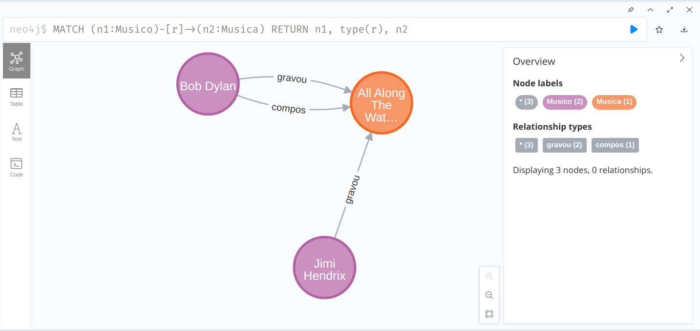

# Lab 05: Neo4J  

## Environment preparation (TODO)

## Exercices

### 1. Follow [script execution](https://neo4j.com/graphgists/cypher-introduction-social-movie-database/)


``` cypher
MATCH (n)
RETURN "Hello Graph with "+count(*)+" Nodes!"
as welcome;
```


```
MATCH (movie:Movie {title:"The Matrix"})
RETURN movie;
```


```
MATCH (movie:Movie {title:"The Matrix"})
RETURN movie.id, movie.title;
```

```
MATCH (m:Movie {title:"The Matrix"})<-[:ACTED_IN]-(actor)
RETURN actor;
```

```
MATCH (m:Movie {title:"The Matrix"})<-[:ACTED_IN]-(actor)
RETURN actor.name order by actor.name;
```

```
MATCH (m:Movie {title:"The Matrix"})<-[:ACTED_IN]-(actor)
RETURN count(*);
```

```
MATCH (m:Movie {title:"The Matrix"})<-[:ACTED_IN]-(actor)
WHERE actor.name =~ ".*s$"
RETURN actor.name;
```

```
MATCH (n)
RETURN count(*);
```

```
MATCH (n)-[r]->()
RETURN type(r), count(*);
```

```
MATCH (n)-[r]->(m)
RETURN n as from, r as `->`, m as to;
```


### 2. Run and [send commands](https://lvdamacenoblog.wordpress.com/2018/06/29/first-steps-neo4j/)


```
CREATE(dylan:Musico{nome:'Bob Dylan', data_de_nascimento: '1941-05-24'})
```

```
CREATE(hendrix:Musico{nome:'Jimi Hendrix'})
```

```
CREATE(al_along:Musica{nome:'All Along The Watchtower'})
```

```
MATCH (hendrix:Musico{nome:'Jimi Hendrix'}),(al_along:Musica{nome:'All Along The Watchtower'})
CREATE (hendrix)-[r:gravou]->(al_along)
```

```
MATCH (bob:Musico {nome: 'Bob Dylan'}), (al_along:Musica {nome: 'All Along The Watchtower'})
CREATE (bob)-[r:gravou]->(al_along)
CREATE (bob)-[s:compos]->(al_along)
```

```
MATCH (m:Musico)
RETURN m.nome
```

```
MATCH (m:Musico)
RETURN m
```

```
MATCH (m)
RETURN m
```

```
MATCH (m:Musico)
WHERE m.nome='Bob Dylan'
RETURN m
```

```
MATCH(m:Musico {nome: 'Bob Dylan'})
RETURN m
```

```
MATCH (n1)<-[]-()
RETURN n1
```

```
MATCH (n1)-[]->()
RETURN n1
```


```
MATCH (n1:Musico)-[r]->(n2:Musica)
RETURN n1, type(r), n2
```

```
MATCH (n1:Musico)-[r:gravou]->(n2:Musica)
RETURN n1, type(r), n2
```

```
MATCH (hendrix:Musico {nome: 'Jimi Hendrix'})
SET hendrix.data_de_nascimento = '1942-11-27'
```

```
MATCH (hendrix:Musico {nome: 'Jimi Hendrix'})
SET hendrix.data_de_nascimento = null
```

```
MATCH (hendrix:Musico {nome: 'Jimi Hendrix'})-[r]-()
DELETE r
```

```
MATCH (hendrix:Musico {nome: 'Jimi Hendrix'})
DELETE hendrix
```

```
MATCH (n) 
OPTIONAL MATCH (n)-[rel]-() 
DELETE rel, n 
```

```
MERGE (n1:Musico {nome: 'Bob Dylan'})
MERGE (n2:Musico {nome: 'Bob Dylan'})
```

```
LOAD CSV WITH HEADERS
FROM "file:///nome_do_arquivo.csv"
AS linha 
MERGE (compositor:Musico {nome: linha.compositor})
MERGE (musica:Musica {nome: linha.musica})
MERGE (compositor)-[:compos]->(musica)
```

```
MATCH (i:Musico)-[g:GRAVOU]->(m:Musica)
RETURN i, m
```

```
MATCH (musico:Musico)-[g:GRAVOU]->(musica:Musica)
RETURN musica, musica
```

```
MATCH (interprete:Musico)-[gravou:GRAVOU]->(musica:Musica)
MATCH (compositor:Musico)-[compos:COMPOS]->(musica:Musica)
RETURN interprete, musica, compositor
```

```
MATCH (interprete:Musico)-[gravou:GRAVOU]->(musica:Musica)
MATCH (compositor:Musico)-[compos:COMPOS]->(musica:Musica)
WHERE interprete.nome = 'Jon Bon Jovi'
RETURN interprete, musica, compositor
```

